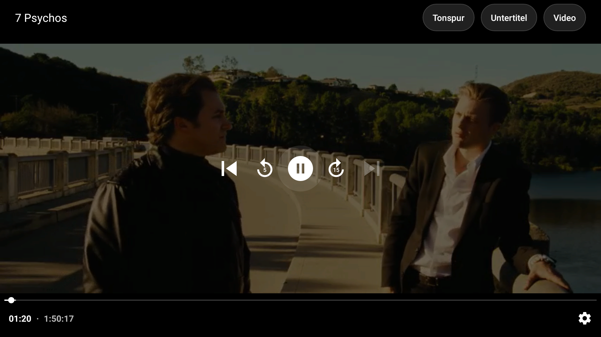
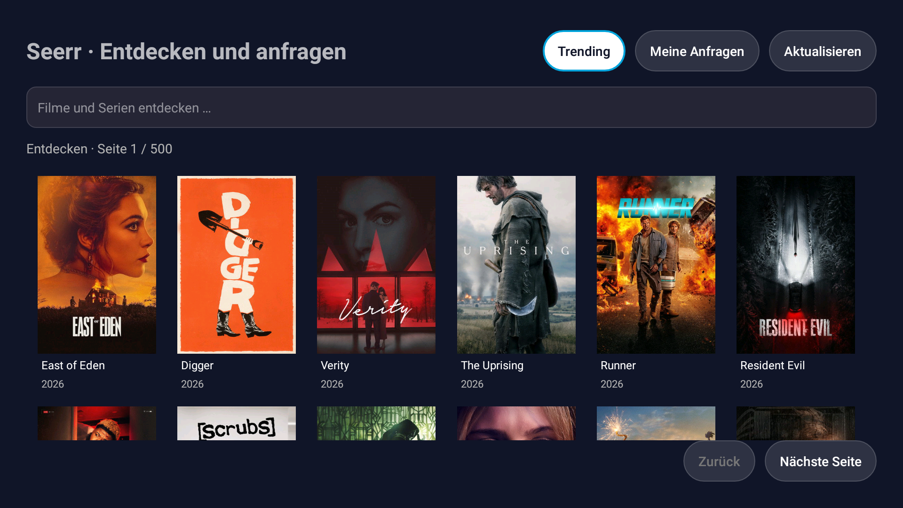

# Firefin

[](LICENSE)
[](COMPATIBILITY.md)
[](COMPATIBILITY.md)

**Firefin** is an independent native Kotlin Jellyfin client for legacy Fire TV
devices, originally derived from Moonfin Core. Not affiliated with or supported
by Moonfin, Jellyfin, Emby, or Amazon.

**Primary target:** Fire TV Stick 2nd Generation / Basic Edition (`AFTT`,
`LY73PR`), Fire OS 5.2.8.0 (Android 5.1 / **API 22**), ARMv7, 1 GB RAM.

> **Status: in development, not release-ready, not feature-equal to the legacy
> app.** No signed release exists. No run on real AFTT hardware has been
> recorded. See [Verification status](#verification-status) and the acceptance
> ledger in [docs/FIREFIN_MIGRATION.md](docs/FIREFIN_MIGRATION.md).

| Field | Native app (this line) | Legacy app (history, validation only) |
|---|---|---|
| Package | `zepigit.firefin.app` | `org.moonfin.firetv32` |
| Version | `0.2.0-firefin` / versionCode `3001000` (`version.properties`) | `1.1.0-firetv32-r21` / `3000028` |
| SDK | minSdk 21, targetSdk 34, compileSdk 35 | minSdk 21 |
| UI | Native Android Views/XML, Media3 ExoPlayer, OkHttp | Flutter + media_kit |
| Language of UI strings | German only at present | English |

The native version code is deliberately above the legacy `3000028` build line.

## Verification status

Evidence basis: the current candidate is being validated on the feature branch;
it is not a published release. The complete migration ledger is in
[docs/FIREFIN_MIGRATION.md](docs/FIREFIN_MIGRATION.md).

Verified locally on the current candidate:

- 56 JVM unit tests pass (`:app:testDebugUnitTest`), including transport, Seerr,
  preferences, playback timeline, source selection and session-report contracts.
- API-22 instrumentation (`:app:connectedDebugAndroidTest`) passes the login-
  screen focus test on the stock x86 AVD.
- Strict debug/release lint: 0 errors (warnings remain documented).
- R8-minified unsigned release APK builds; debug and release APK metadata is
  checked by `scripts/verify-native-apk.py` (debug ABIs: armeabi-v7a/x86;
  release ABI: armeabi-v7a only).
- API 22 x86 emulator with the authorized Jellyfin test account: login, Moonfin-like
  Home/Library/Detail/Search/Settings navigation, Seerr discovery/search/detail/
  season confirmation, TMDB artwork over the API-22 TLS stack, resume playback,
  D-pad controller, audio-track dialog, pause/return cleanup and 480p/1 Mbit
  playback were exercised. The emulator needed the debug baseline H.264 profile;
  the real AFTT release profile negotiates up to 1080p/4 Mbit, but physical AFTT
  decoder and thermal behavior remain unverified.

Still externally blocked and not claimed complete:

- Physical AFTT/ARMv7 install, hardware decoder/memory/thermal behavior and
  production playback.
- Protected production keystore/secrets for a signed release and certificate
  verification.
- CI run for this still-uncommitted candidate.

### Current native screenshots

These are real API-22 emulator captures from the current candidate, with no
credentials or tokens visible:





## Feature parity (open)

The native app covers password login, a home screen (continue watching, next
up, latest for up to four movie/show/mixed libraries), library grids, details
with episodes, search, favorite/watched toggles, Media3 playback with D-pad
control, remote session control and basic settings (image cache, logout).
The current slim native target deliberately prioritizes the old Fire TV device:
Jellyfin login, Moonfin-like Home/library/detail/search/player flows, D-pad
focus, account-safe playback, Seerr through Moonbase (discovery, search,
status, season selection, request dialog and submission code; live server submission is not claimed), bounded artwork and stored /
effective playback preferences. It deliberately does not claim Live TV,
offline downloads, music/books/photos/DLNA, admin, plugin sync, parental/PIN,
full Quick Connect code polling or every modern Moonfin screen. Flutter sources
remain in the repository until the selected native flows are accepted. Track
this scope and evidence in [docs/FIREFIN_MIGRATION.md](docs/FIREFIN_MIGRATION.md).

## Install note (important)

The native Firefin app uses a **new application ID**. It is a different
Android app, not an in-place update of the old one:

- The old Moonfin FireTV32 app (`org.moonfin.firetv32`) can stay installed
  side by side; it is not uninstalled or wiped automatically.
- Firefin starts with a fresh login; tokens and settings from the old app are
  **not** migrated automatically.

## Build (native app)

Requires JDK 17 and Android SDK platform 35 with build-tools 35.0.0; the Gradle
wrapper (8.10.2) is included. See [BUILDING.md](BUILDING.md) for the full
procedure, artifact names, APK verification and the protected release flow.

```bash
./gradlew --no-daemon :app:testDebugUnitTest :app:lintDebug :app:lintRelease :app:assembleDebug :app:assembleRelease
```

Outputs: `app/build/outputs/apk/debug/app-debug.apk` (debug-signed, testing
only) and `app/build/outputs/apk/release/app-release-unsigned.apk` (R8, unsigned
validation artifact, not a release). A signed release is produced only by the
manual, protected `Firefin signed release` workflow with `FIREFIN_*` secrets;
there is no debug-key fallback for releases.

## Security

Default platform TLS trust, no certificate or hostname bypass, no automatic
redirect following to other origins, tokens sent in a header only. Details and
limits: [SECURITY.md](SECURITY.md).

## Origin and licensing

Firefin descends from the Moonfin FireTV32 backport of
[Moonfin-Client/Moonfin-Core](https://github.com/Moonfin-Client/Moonfin-Core)
(GPL-2.0). The repaired git history preserves the upstream commits and their
authors; see [THIRD_PARTY_NOTICES.md](THIRD_PARTY_NOTICES.md),
[LICENSE](LICENSE) and [docs/FIREFIN_MIGRATION.md](docs/FIREFIN_MIGRATION.md).

Bugs and support belong to Firefin, not to Moonfin.
