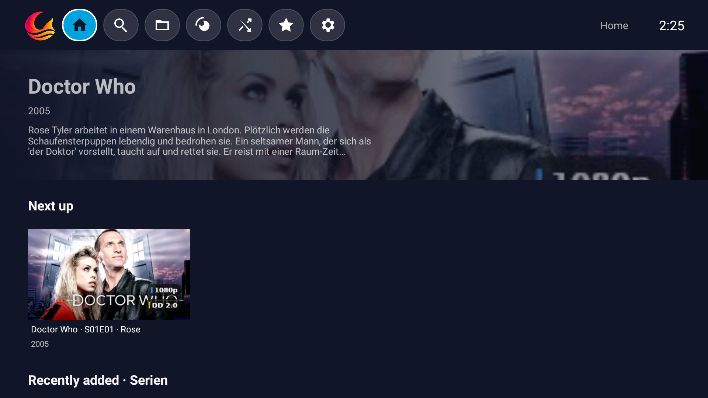
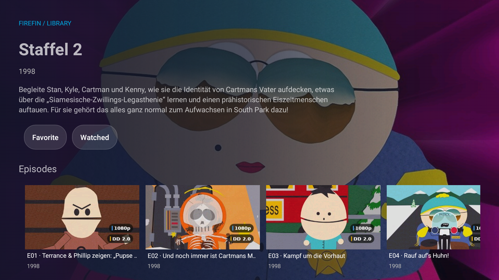
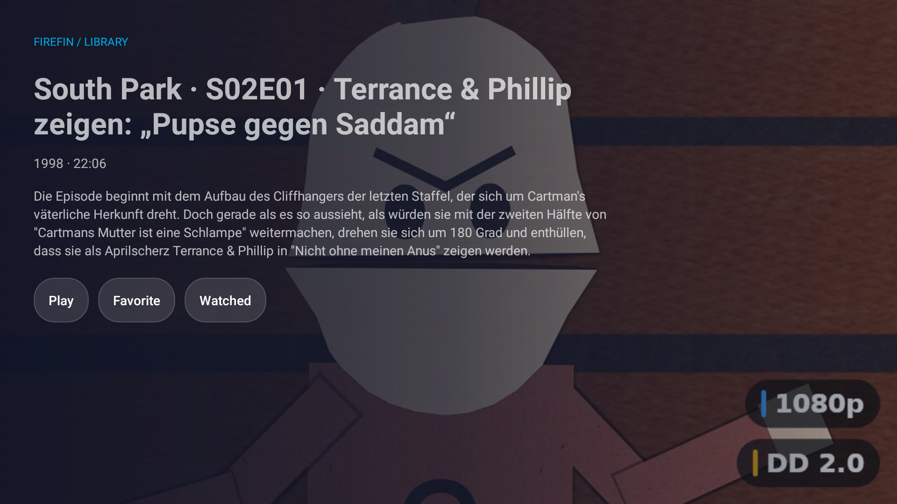
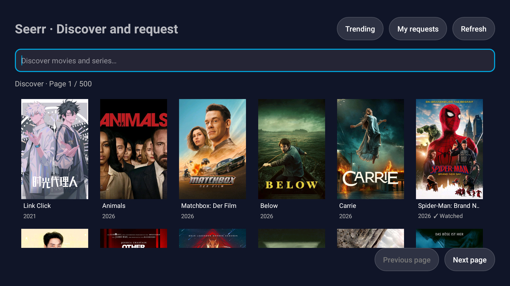
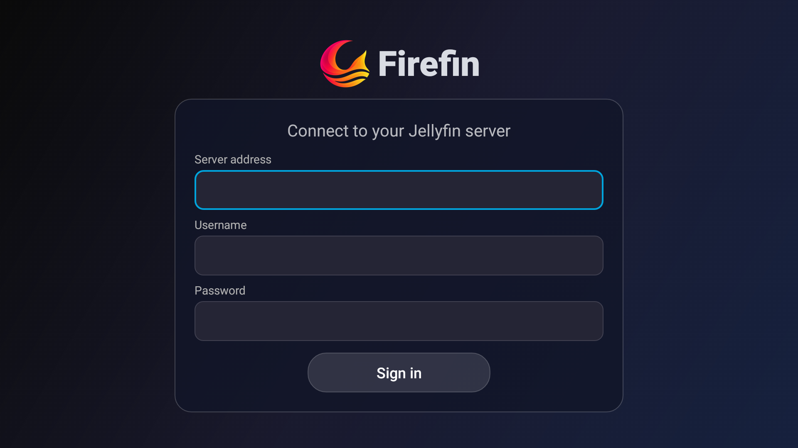

<p align="center">
  
</p>

<h1 align="center">Firefin</h1>

<p align="center">
  <strong>Native Jellyfin/Moonfin experience for older FireTV-Sticks and Android 5 devices.</strong><br />
  Targets the first and second-generation Fire TV Stick and the legacy Fire TV profile described below.
</p>

<p align="center">
  <a href="LICENSE"></a>
  <a href="docs/COMPATIBILITY.md"></a>
  <a href="docs/COMPATIBILITY.md"></a>
  <a href="docs/FIREFIN_TECHNICAL_OVERVIEW.md"></a>
</p>


Firefin is a 32-bit native Android TV application for watching, discovering and browsing media from a Jellyfin server. It is built around a simple idea: the living-room interface should stay readable from a sofa, with every important action reachable by remote control. Firefin is derived from the Moonfin Core codebase and is an independent project, not affiliated with Moonfin, Jellyfin, Emby or Amazon. See [third-party notices](docs/THIRD_PARTY_NOTICES.md) for attribution and licensing details.


## Main features

- A clean TV-first home screen with continue watching, next up and library rows
- Remote-friendly navigation for home, search, libraries, random playback, favourites, requests and settings
- Media details with descriptions, release information, playback actions and watched state
- Series browsing with seasons and episodes
- Jellyfin library search alongside Seerr/Moonbase discovery results
- Media3 playback with audio and subtitle selection, resume support and D-pad controls
- Seerr request discovery, title details, season selection and confirmation flows

This project is not about being the best Jellyfin/Moonfin alternative. It doesn't even aim to be a good Jellyfin/Moonfin player at all. The goal is to give perfectly fine old devices, which became obsolete because no native app supports them anymore, a purpose again and restore compatibility.

## Screenshots

<table>
  <tr>
    <td width="50%">
      
      <p align="center"><sub><strong>Home</strong><br />Icon navigation and next-up browsing.</sub></p>
    </td>
    <td width="50%">
      
      <p align="center"><sub><strong>Series</strong><br />Overview, watched state and season browsing.</sub></p>
    </td>
  </tr>
  <tr>
    <td width="50%">
      
      <p align="center"><sub><strong>Episode details</strong><br />Playback, favourites and watched-state actions.</sub></p>
    </td>
    <td width="50%">
      
      <p align="center"><sub><strong>Requests</strong><br />Seerr discovery and request browsing through Moonbase.</sub></p>
    </td>
  </tr>
  <tr>
    <td width="50%">
      
      <p align="center"><sub><strong>Sign in</strong><br />Readable branding and labeled TV-friendly fields.</sub></p>
    </td>
  </tr>
</table>

<sub>Captured from the current local build on the Android 5.1/API-22 emulator at 1920×1080. Interface labels are English; server-provided titles and descriptions may be German. The interface follows the device language. These captures are not physical Fire TV validation or a new published release.</sub>

## Works with

| Service | Compatibility |
|---|---|
| **Jellyfin Server** | Main media source for login, libraries, search, details, playback and watched state |
| **Moonbase / Seerr** | Optional discovery and media-request service. Moonbase is the bridge installed alongside Jellyfin; Firefin reaches Seerr through it. |

Firefin does not require a second media server. It connects to the Jellyfin server you choose and uses Moonbase/Seerr only when that service is available and configured.

## Device compatibility

| Device or platform | Status |
|---|---|
| **Fire TV Stick 2nd Generation (AFTT)** | Primary target; Fire OS 5 / Android API 22 / ARMv7. |
| **Fire TV Stick Basic Edition (LY73PR)** | Primary target; Fire OS 5 / Android API 22 / ARMv7. |
| **Fire TV Stick 1st Generation** | Expected to work (Fire OS 5 / ARMv7), not tested. |
| **Newer 64-bit Fire TV devices** | Might work, but for God's sake, use something else please. |

The app is intentionally tuned for the resource limits of the older Fire TV sticks. No flashy animations, no bling bling, but it gets the job done. Newer hardware may run it, but compatibility should not be assumed without testing.

## Installation

Signed Firefin APKs are published on the [releases page](https://github.com/ZepiGit/Firefin-Player-Android5.1-API22/releases); Firefin releases are tagged `firefin-v<version>`. Firefin is not in the Amazon Appstore, so it is installed by sideloading.

1. **Allow sideloading.** On the Fire TV open *Settings → Device* (on newer models *My Fire TV*) *→ Developer options* and turn on *Apps from Unknown Sources*. For the ADB route also turn on *ADB debugging*.
2. **Install the APK**, either way works:
   - **Downloader app:** install *Downloader* from the Amazon Appstore, open the releases page above in it and select `Firefin_<version>.apk` of the newest release.
   - **ADB from a computer** on the same network:

     ```bash
     adb connect <fire-tv-ip-address>
     adb install -r Firefin_<version>.apk
     ```
3. **Optional: check the download.** Compare the APK's SHA-256 with `SHA256SUMS.txt` from the same release (`sha256sum` on Linux/macOS, `Get-FileHash` in PowerShell).
4. **Sign in** with your Jellyfin address, user name and password:
   - Home network without HTTPS: `http://192.168.1.10:8096` (Firefin asks you to confirm the unencrypted connection).
   - HTTPS: `https://jellyfin.example.com`. Certificates from public authorities, including Let's Encrypt, are supported; self-signed certificates are not.

**Media requests:** with an enabled Moonbase/Seerr integration, a fresh Jellyfin password sign-in also attempts to connect Seerr automatically without storing the password. After updating an existing session, sign out and sign in once to enable this. A separate Seerr sign-in remains available if the bridge cannot authenticate your account.

**Updates:** install the new APK over the old one; sign-in and settings stay. The old *Moonfin FireTV32* app (`org.moonfin.firetv32`) is a separate app: it can stay installed next to Firefin, and its sign-in and settings are not taken over.

### Troubleshooting

| Message or symptom | What to check |
|---|---|
| "The server did not accept a secure HTTPS connection" | The address was entered without `http://` and the server only speaks HTTP. Enter it with `http://`. |
| "This device does not trust the server certificate" | The certificate must be valid, match the address and come from a public authority. Fire OS 5 has an old certificate store; Firefin adds Let's Encrypt itself. |
| "The server cannot be reached" | Address, port (Jellyfin default: 8096) and that the Fire TV is on the same network. |
| Media requests are unavailable | Seerr is reached through the Moonbase plugin on the Jellyfin server; without Moonbase, requests stay hidden. |

To build Firefin yourself, start with [build guide](docs/BUILDING.md) and the technical overview in [docs/FIREFIN_TECHNICAL_OVERVIEW.md](docs/FIREFIN_TECHNICAL_OVERVIEW.md).

## Project status

Firefin 32-bit is still in development and the native TV experience is actively being completed. It has been tested on an Android 5.1 (API 22) emulator; a run on physical Fire TV Stick hardware is still outstanding. Sending media requests to a live Seerr server has not been verified yet. Firefin does not claim support for Live TV/DVR, offline downloads, music or book readers, DLNA, administration or every modern Jellyfin client feature, but if you've got an old Fire TV or Android TV device lying around, it might be just for you.

For compatibility boundaries, security notes and verification evidence, see:

- [Compatibility](docs/COMPATIBILITY.md)
- [Security](SECURITY.md)
- [Technical overview](docs/FIREFIN_TECHNICAL_OVERVIEW.md)
- [Changelog](CHANGELOG.md)
- [Third-party notices](docs/THIRD_PARTY_NOTICES.md)

## License

Firefin is distributed under the GPL-2.0 license. See [LICENSE](LICENSE).
