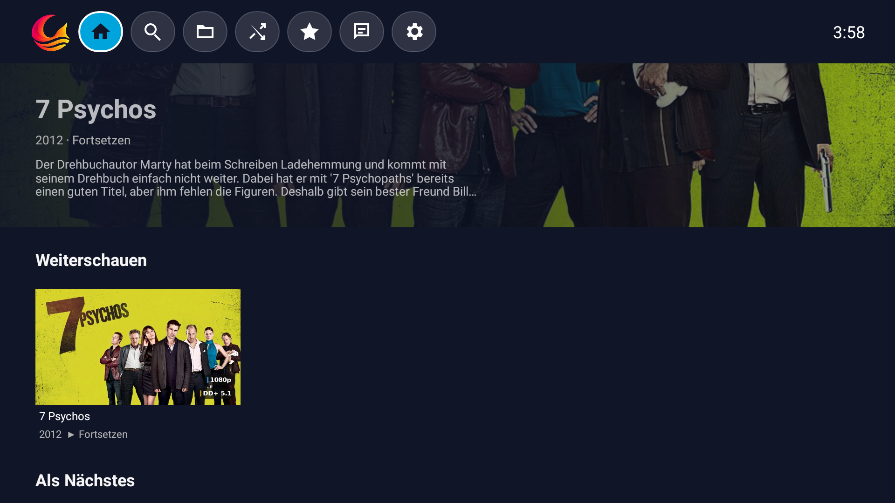
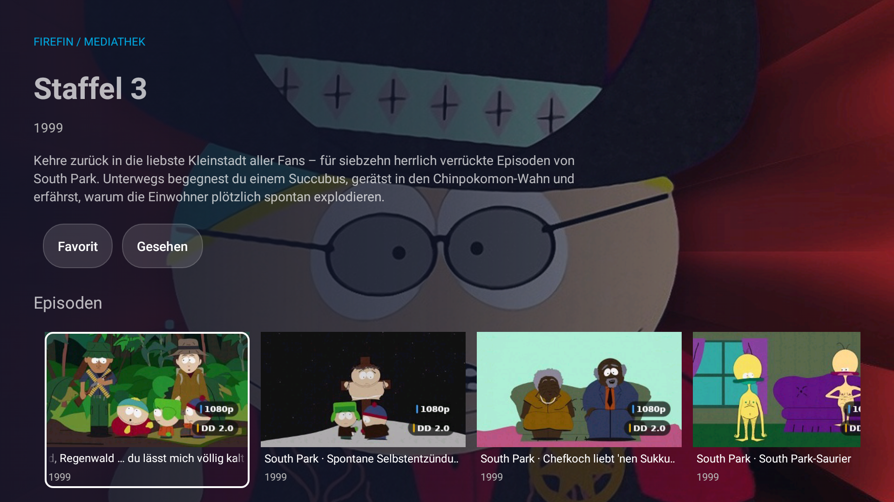
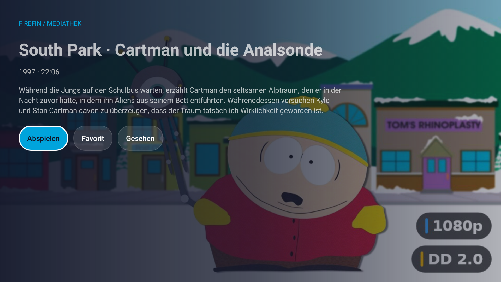
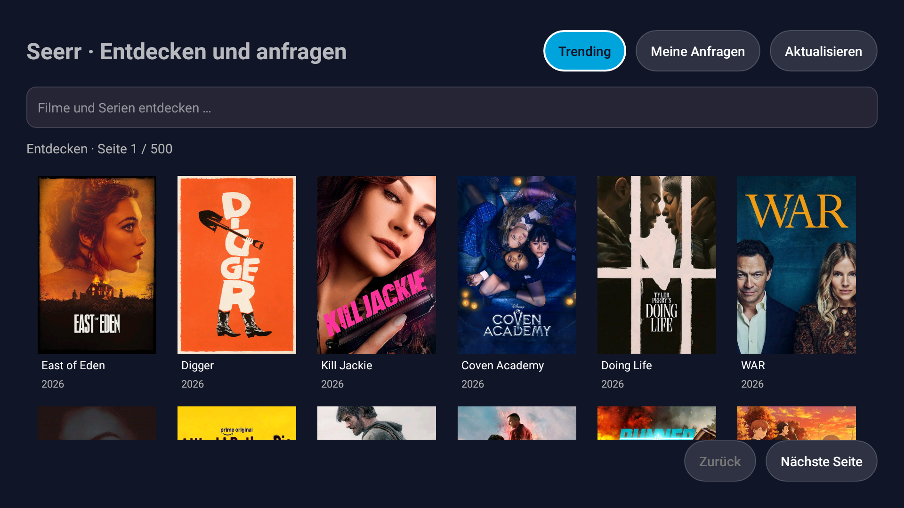

  

<h1 align="center">Firefin</h1>

  <strong>Native Jellyfin/Moonfin experience for older FireTV-Sticks and Android 5 devices.</strong> 
  Targets the first and second-generation Fire TV Stick and the legacy Fire TV profile described below.

  
  
  
  

Firefin is a 32bit native Android TV application for watching, discovering and browsing media from a Jellyfin server. It is built around a simple idea: the living-room interface should stay readable from a sofa, with every important action reachable by remote control. Firefin is derived from the Moonfin Core codebase and is an independent project, not affiliated with Moonfin, Jellyfin, Emby or Amazon. See [third-party notices](THIRD_PARTY_NOTICES.md) for attribution and licensing details.

## Main features

- A clean TV-first home screen with continue watching, next up and library rows
- Remote-friendly navigation for home, search, libraries, random playback, favourites, requests and settings
- Media details with descriptions, release information, playback actions and watched state
- Series browsing with seasons and episodes
- Jellyfin library search alongside Seerr/Moonbase discovery results
- Media3 playback with audio and subtitle selection, resume support and D-pad controls
- Seerr request discovery, title details, season selection and confirmation flows

This project is not about being the best Jellyfin/Moonfin alternative. It doesn't even aim to be a good Jellyfin/Moonfin player at all. The goal is to give perfectly fine old devices that were obsolete due to no native app compatability a purpose again and recreate compatability.

## Screenshots

<table>
  <tr>
    <td width="50%">
      
      
<strong>Home</strong> Icon navigation and continue watching.

    </td>
    <td width="50%">
      
      
<strong>Series</strong> Overview, watched state and season browsing.

    </td>
  </tr>
  <tr>
    <td width="50%">
      
      
<strong>Episode details</strong> Playback, favourites and watched-state actions.

    </td>
    <td width="50%">
      
      
<strong>Requests</strong> Seerr discovery and request browsing through Moonbase.

    </td>
  </tr>
</table>

## Works with

| Service | Compatibility |
|---|---|
| **Jellyfin Server** | Main media source for login, libraries, search, details, playback and watched state |
| **Moonbase / Seerr** | Optional discovery and media-request service. Moonbase is the bridge installed alongside Jellyfin; Firefin reaches Seerr through it. |

Firefin does not require a second media server. It connects to the Jellyfin server you choose and uses Moonbase/Seerr only when that service is available and configured.

## Device compatibility

| Device or platform | Status |
|---|---|
| **Fire TV Stick 2nd Generation (AFTT)** | Primary target; Fire OS 5 / Android API 22 / ARMv7. |
| **Fire TV Stick Basic Edition (LY73PR)** | Primary target; Fire OS 5 / Android API 22 / ARMv7. |
| **Fire TV Stick 1st Generation** | 
| **Newer 64-bit Fire TV devices** | Might work, but for gods sake, use something else please. |

The app is intentionally tuned for the resource limits of the older Fire TV sticks. No flashy anymations, no bling bling, but gets the job done. Newer hardware may run it, but compatibility should not be assumed without testing.

## Getting started

Signed Firefin-APKs are published on the [releases page](https://github.com/ZepiGit/Firefin/releases); Firefin releases are tagged `firefin-v<version>`. Firefin 32bit is still in development. To build it yourself, start with [BUILDING.md](BUILDING.md) and the technical overview in [docs/FIREFIN_TECHNICAL_OVERVIEW.md](docs/FIREFIN_TECHNICAL_OVERVIEW.md).

## Project status

The native TV experience is actively being completed. Firefin does not claim support for Live TV/DVR, offline downloads, music or book readers, DLNA, administration or every modern Jellyfin client feature, but if you got a old fireTV or AndroidTV Device laying around, it might be just for you.

For compatibility boundaries, security notes and verification evidence, see:

- [Compatibility](COMPATIBILITY.md)
- [Security](SECURITY.md)
- [Technical overview](docs/FIREFIN_TECHNICAL_OVERVIEW.md)
- [Third-party notices](THIRD_PARTY_NOTICES.md)

## License

Firefin is distributed under the GPL-2.0 license. See [LICENSE](LICENSE).
